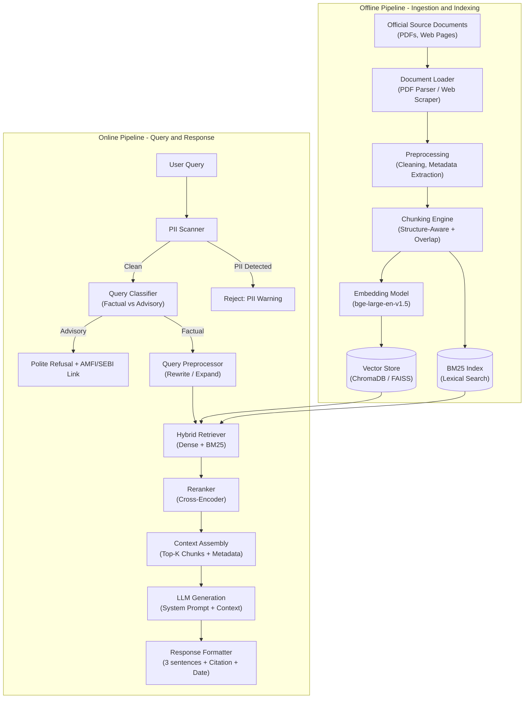
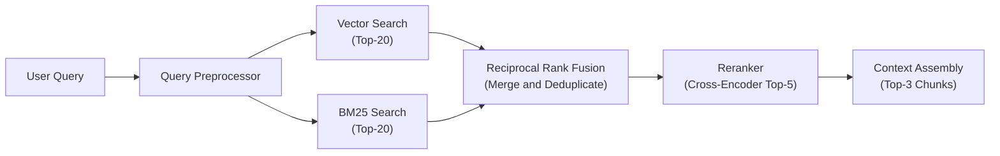
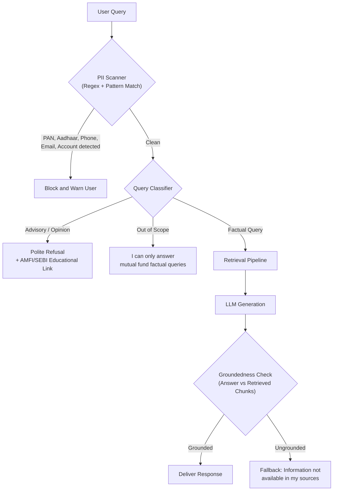
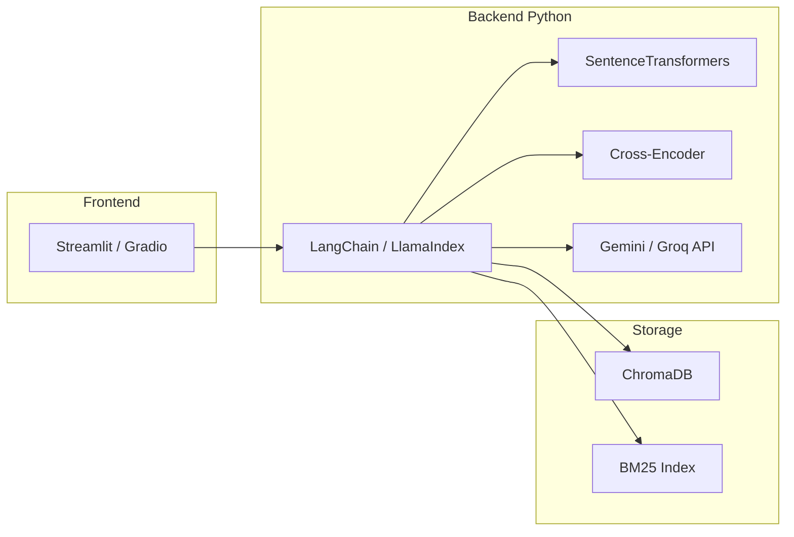
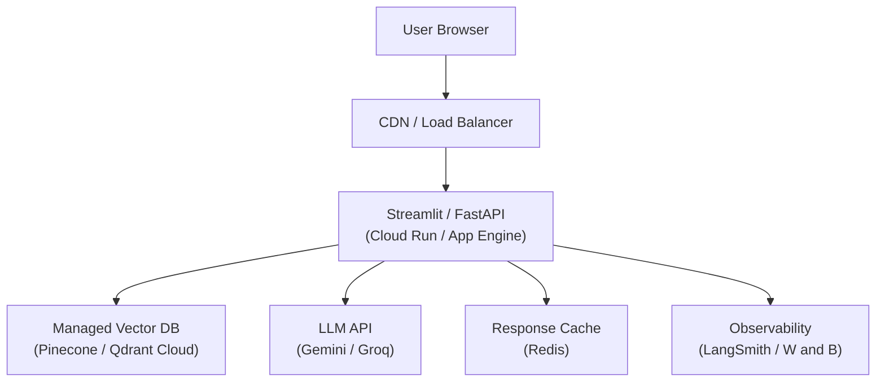

# Architecture – Mutual Fund Facts-Only FAQ Assistant

> **Version**: 1.0  
> **Date**: 2026-08-25  
> **Status**: Proposed  

---

## Table of Contents

1. [System Overview](#1-system-overview)
2. [High-Level Architecture](#2-high-level-architecture)
3. [Component Details](#3-component-details)
   - 3.1 [Data Ingestion Pipeline (Offline)](#31-data-ingestion-pipeline-offline)
   - 3.2 [Retrieval Pipeline (Online)](#32-retrieval-pipeline-online)
   - 3.3 [Generation Layer](#33-generation-layer)
   - 3.4 [Guardrails & Safety Layer](#34-guardrails--safety-layer)
   - 3.5 [User Interface](#35-user-interface)
4. [Data Model & Storage](#4-data-model--storage)
5. [Technology Stack](#5-technology-stack)
6. [Prompt Engineering](#6-prompt-engineering)
7. [Evaluation Strategy](#7-evaluation-strategy)
8. [Deployment Architecture](#8-deployment-architecture)
9. [Security & Privacy](#9-security--privacy)
10. [Known Limitations & Risks](#10-known-limitations--risks)

---

## 1. System Overview

This system is a **Retrieval-Augmented Generation (RAG)** assistant that answers objective, verifiable questions about HDFC Mutual Fund schemes. It retrieves facts exclusively from official public documents (AMC factsheets, SIDs, AMFI, SEBI circulars) and generates concise, cited responses. It **never** provides investment advice, opinions, or recommendations.

### Design Principles

| Principle | Description |
|---|---|
| **Facts-Only** | Every answer must be grounded in retrieved source text. No hallucination, no opinion. |
| **Source Transparency** | Every response includes exactly one citation link and a "Last updated" footer. |
| **Strict Refusal** | Advisory/opinion queries are politely declined with an educational link. |
| **Privacy by Design** | No PII is accepted, stored, or processed. |
| **Offline/Online Separation** | Ingestion and indexing are decoupled from real-time query serving. |

---

## 2. High-Level Architecture



---

## 3. Component Details

### 3.1 Data Ingestion Pipeline (Offline)

This pipeline runs **on-demand** whenever the source corpus is updated. It transforms raw documents into searchable, embedded chunks.

#### Document Loading

| Source Type | Loader | Documents |
|---|---|---|
| Web Pages (HTML) | `BeautifulSoup` / `requests` | HDFC MF FAQ pages, charges page, statement guides |

#### Source URLs (Corpus)

**Groww Scheme Pages:**
- https://groww.in/mutual-funds/hdfc-mid-cap-fund-direct-growth
- https://groww.in/mutual-funds/hdfc-small-cap-fund-direct-growth
- https://groww.in/mutual-funds/hdfc-multi-cap-fund-direct-growth
- https://groww.in/mutual-funds/hdfc-large-and-mid-cap-fund-direct-growth
- https://groww.in/mutual-funds/hdfc-gold-etf-fund-of-fund-direct-plan-growth


#### Preprocessing

1. **Text Extraction** – Convert  HTML to clean plaintext, preserving table structures.
2. **Metadata Extraction** – For each document, extract and store:
   - `source_url`: Original public URL
   - `document_type`: `factsheet` | `sid` | `faq` | `circular` | `guide`
   - `scheme_name`: Fund name (e.g., "HDFC Mid-Cap Fund")
   - `publisher`: `HDFC AMC` | `SEBI` | `AMFI`
   - `last_updated`: Date the document was last fetched/published
3. **Cleaning** – Remove headers, footers, page numbers, watermarks, and boilerplate disclaimers that don't carry factual content.

#### Chunking Strategy

```
Strategy: Structure-Aware Chunking with Overlap
├── Primary Split: By document section headers (H1/H2/H3)
├── Secondary Split: Paragraph-level within sections
├── Chunk Size Target: 300–500 tokens
├── Overlap: 50 tokens (~10-15%)
└── Special Handling:
    ├── Tables → Kept as atomic chunks (not split across rows)
    ├── FAQ Q&A pairs → One chunk per question-answer pair
    └── Scheme-specific sections → Tagged with scheme metadata
```

> **IMPORTANT**: Tables (expense ratios, exit loads, SIP amounts) are the highest-value data for this assistant. They must **never** be split mid-row. Each table is stored as a single chunk with its column headers preserved.

#### Embedding & Indexing

| Component | Choice | Rationale |
|---|---|---|
| Embedding Model | `BAAI/bge-large-en-v1.5` (1024-dim) | Strong semantic quality, top-tier retrieval accuracy for financial domain, MTEB benchmark leader |
| Vector Store | **ChromaDB** (local, file-persisted) | Zero-infrastructure, sufficient for fewer than 1000 chunks, easy prototyping |
| Lexical Index | **BM25** (via `rank_bm25`) | Captures exact financial terms (e.g., "ELSS", "Nifty 50", "Section 80C") that embeddings may miss |

---

### 3.2 Retrieval Pipeline (Online)



#### Step-by-Step

| Step | Detail |
|---|---|
| **1. Query Preprocessing** | Normalize query: lowercase, strip noise. Optionally expand abbreviations (e.g., "ER" → "expense ratio"). |
| **2. Dual Retrieval** | Run the query against both the vector store (semantic similarity) and BM25 index (lexical match) in parallel, fetching Top-20 candidates from each. |
| **3. Reciprocal Rank Fusion (RRF)** | Merge results from both retrievers using RRF scoring: `score = Σ 1/(k + rank)` where `k = 60`. Deduplicate by chunk ID. |
| **4. Reranking** | Pass the top merged candidates through a cross-encoder reranker (`cross-encoder/ms-marco-MiniLM-L-6-v2`) to re-score by query-chunk relevance. Select Top-3. |
| **5. Context Assembly** | Concatenate the top-3 chunk texts with their metadata (source URL, scheme name, last-updated date) into a structured context block for the LLM. |

> **Why Hybrid Retrieval?** Financial documents contain domain-specific acronyms and proper nouns (ELSS, XIRR, HDFC Mid-Cap, Section 80C) that pure semantic search often misses. BM25 ensures exact-match recall for these critical terms.

---

### 3.3 Generation Layer

| Parameter | Value |
|---|---|
| **LLM** | `google/gemini-3.1-pro` (via API) or Groq-hosted model (via Groq API) as fallback |
| **Temperature** | `0.0` (deterministic, no creativity needed) |
| **Max Output Tokens** | `200` (enforces brevity — 3 sentences or fewer) |
| **Fallback** | If no relevant chunks are retrieved (similarity score below threshold), return: *"I don't have this information in my current sources. Please check the official HDFC MF website."* |

The LLM receives a **system prompt** (see [Section 6: Prompt Engineering](#6-prompt-engineering)) and a **context block** assembled from the top-3 retrieved chunks. It generates a response that is then passed through the **Response Formatter**.

#### Response Format (Enforced)

```
<Answer in 3 sentences or fewer>

Source: <URL>
Last updated from sources: <YYYY-MM-DD>
```

---

### 3.4 Guardrails & Safety Layer

This layer intercepts every user query **before** retrieval and every generated response **before** delivery.



#### PII Detection Patterns

| PII Type | Pattern |
|---|---|
| PAN | `[A-Z]{5}[0-9]{4}[A-Z]` |
| Aadhaar | `\d{4}\s?\d{4}\s?\d{4}` |
| Phone | `(\+91)?[6-9]\d{9}` |
| Email | Standard email regex |
| Account Numbers | `\d{9,18}` (contextual) |

#### Advisory Query Detection

A lightweight classifier (keyword + few-shot LLM classification) detects advisory intent:

| Signal | Examples |
|---|---|
| Comparison keywords | "better", "best", "vs", "compare returns" |
| Advice-seeking | "should I", "recommend", "suggest", "is it good" |
| Return prediction | "will it give", "expected return", "future performance" |

**Refusal Template:**
```
I'm designed to provide only factual information about mutual fund schemes.
For investment guidance, please consult a SEBI-registered advisor or visit
https://www.amfiindia.com/investor-corner/knowledge-center.html
```

---

### 3.5 User Interface

A minimal, single-page chat interface.

#### Layout

```
┌─────────────────────────────────────────────┐
│  Mutual Fund Facts Assistant                │
│  ──────────────────────────────────────────  │
│  ⚠ Facts-only. No investment advice.        │
│                                             │
│  Try asking:                                │
│  • "What is the expense ratio of HDFC       │
│     Mid-Cap Fund?"                          │
│  • "What is the exit load for HDFC ELSS     │
│     Tax Saver?"                             │
│  • "How do I download my account            │
│     statement from HDFC MF?"                │
│                                             │
│  ┌─────────────────────────────────────┐    │
│  │ Chat history scrollable area        │    │
│  │                                     │    │
│  │  User: What is the minimum SIP...   │    │
│  │  Bot:  The minimum SIP amount for   │    │
│  │        HDFC Mid-Cap Fund is ₹100... │    │
│  │        Source: https://...          │    │
│  │        Last updated from sources:   │    │
│  │        2026-05-15                   │    │
│  └─────────────────────────────────────┘    │
│  ┌────────────────────────────┐ [Send]      │
│  │ Type your question...      │             │
│  └────────────────────────────┘             │
└─────────────────────────────────────────────┘
```

#### Tech

| Concern | Choice |
|---|---|
| Framework | **Streamlit** (rapid prototyping) or **Gradio** |
| State | Session-based chat history (in-memory) |
| Deployment | Local / Streamlit Cloud |

---

## 4. Data Model & Storage

### Chunk Schema

Each chunk stored in the vector store carries the following fields:

```json
{
  "chunk_id": "hdfc_midcap_factsheet_chunk_007",
  "text": "The expense ratio for HDFC Mid-Cap Opportunities Fund – Regular Plan is 1.64% and for Direct Plan is 0.73% as on March 31, 2026.",
  "embedding": [0.012, -0.045, "..."],
  "metadata": {
    "source_url": "https://www.hdfcfund.com/literature/factsheet",
    "document_type": "factsheet",
    "scheme_name": "HDFC Mid-Cap Opportunities Fund",
    "publisher": "HDFC AMC",
    "last_updated": "2026-05-15",
    "page_number": 12,
    "chunk_index": 7,
    "total_chunks_in_doc": 34
  }
}
```

### Corpus Statistics (Estimated)

| Metric | Estimate |
|---|---|
| Source Documents | 13 (PDFs + web pages) |
| Total Pages (approx.) | ~200–300 |
| Total Chunks (after splitting) | ~500–800 |
| Vector Index Size | ~2–5 MB |

---

## 5. Technology Stack



| Layer | Technology | Version |
|---|---|---|
| **Language** | Python | 3.11+ |
| **Orchestration** | LangChain | latest |
| **Embeddings** | `sentence-transformers` (`BAAI/bge-large-en-v1.5`) | latest |
| **Vector DB** | ChromaDB | latest |
| **Lexical Search** | `rank_bm25` | latest |
| **Reranker** | `cross-encoder/ms-marco-MiniLM-L-6-v2` | latest |
| **LLM** | Google Gemini 3.1 Pro (primary) / Groq (fallback) | latest |
| **PDF Parsing** | `PyMuPDF` (`fitz`) + `pdfplumber` (for tables) | latest |
| **Web Scraping** | `BeautifulSoup4` + `requests` | latest |
| **UI** | Streamlit | latest |
| **Evaluation** | RAGAS | latest |

---

## 6. Prompt Engineering

### System Prompt

```text
You are a facts-only FAQ assistant for HDFC Mutual Fund schemes.

RULES — follow these strictly:
1. Answer ONLY using the provided context. Never use outside knowledge.
2. If the context does not contain the answer, say: "I don't have this
   information in my current sources. Please check the official HDFC MF
   website."
3. Keep answers to 3 sentences or fewer.
4. Never give investment advice, opinions, comparisons, or return predictions.
5. Always end your response with exactly one source URL and a date footer in
   this format:
   Source: <url>
   Last updated from sources: <date>
6. If the user asks for advice or opinions, politely refuse and link to
   https://www.amfiindia.com/investor-corner/knowledge-center.html

CONTEXT:
{retrieved_chunks}

USER QUESTION:
{user_query}
```

### Few-Shot Examples (In-Prompt)

```text
Example 1:
Q: What is the exit load for HDFC Mid-Cap Fund?
A: HDFC Mid-Cap Opportunities Fund charges an exit load of 1% if redeemed
   within 1 year from the date of allotment. No exit load is charged after
   1 year.

   Source: https://www.hdfcfund.com/literature/sid-hdfc-mid-cap
   Last updated from sources: 2025-11-21

Example 2:
Q: Should I invest in HDFC ELSS Tax Saver?
A: I'm designed to provide only factual information about mutual fund schemes.
   For investment guidance, please consult a SEBI-registered advisor or visit
   https://www.amfiindia.com/investor-corner/knowledge-center.html
```

---

## 7. Evaluation Strategy

### Metrics

| Metric | Definition | Target |
|---|---|---|
| **Context Recall** | % of ground-truth answer sentences supported by retrieved chunks | >= 90% |
| **Retrieval Precision** | % of retrieved chunks that are relevant to the query | >= 80% |
| **Faithfulness** | % of generated claims that are grounded in retrieved context (no hallucination) | >= 95% |
| **Answer Relevance** | Semantic similarity between query and generated answer | >= 85% |
| **Refusal Accuracy** | % of advisory queries correctly refused | 100% |
| **Citation Accuracy** | % of responses with a valid, correct source link | 100% |

### Test Set

Build a curated test set of **30–50 question-answer pairs** covering:

| Category | Count | Examples |
|---|---|---|
| Factual – Expense Ratio | 5–8 | "What is the expense ratio of HDFC Small Cap Fund?" |
| Factual – Exit Load | 5–8 | "Is there an exit load for HDFC ELSS Tax Saver?" |
| Factual – SIP / Min Investment | 3–5 | "What is the minimum SIP amount for HDFC Large Cap?" |
| Factual – Process/How-To | 3–5 | "How do I download my capital gains statement?" |
| Factual – Riskometer / Benchmark | 3–5 | "What is the benchmark for HDFC Mid-Cap Fund?" |
| Advisory (must refuse) | 5–8 | "Should I switch from HDFC ELSS to Mid-Cap?" |
| PII (must block) | 3–5 | "My PAN is ABCDE1234F, check my portfolio" |
| Out of Scope | 3–5 | "What is the weather today?" |

### Evaluation Framework

```
RAGAS Pipeline:
  Input:  (question, ground_truth_answer, retrieved_contexts, generated_answer)
  Output: faithfulness, answer_relevance, context_recall, context_precision
```

---

## 8. Deployment Architecture

### Prototype (Local)

```
┌───────────────────────────────────────┐
│           Developer Machine           │
│                                       │
│  Streamlit UI (:8501)                 │
│       │                               │
│       ▼                               │
│  Python Backend                       │
│  ├── LangChain Orchestrator           │
│  ├── ChromaDB (file-persisted)        │
│  ├── BM25 Index (pickle file)         │
│  └── SentenceTransformers (local)     │
│       │                               │
│       ▼ (API calls)                   │
│  External: Gemini 3.1 Pro / Groq      │
└───────────────────────────────────────┘
```

### Production-Ready (Future)



---

## 9. Security & Privacy

| Concern | Mitigation |
|---|---|
| **No PII Processing** | Regex-based PII scanner blocks queries containing PAN, Aadhaar, phone, email, or account numbers before any processing occurs. |
| **No Data Retention** | Chat history is session-only (in-memory). No conversations are logged or stored. |
| **API Key Security** | All API keys (Gemini, Groq) stored in `.env` file, never committed to version control. `.env` added to `.gitignore`. |
| **Source Integrity** | Corpus is built exclusively from official AMC/AMFI/SEBI sources. No third-party blogs, aggregators, or user-generated content. |
| **Prompt Injection** | System prompt is hardcoded and not exposed to users. User input is sanitized before inclusion in the prompt template. |

---

## 10. Known Limitations & Risks

| Limitation | Impact | Mitigation |
|---|---|---|
| **Static Corpus** | Data becomes stale as AMCs update factsheets. | Document `last_updated` dates; manual refresh cadence (monthly). Future: automated scraping pipeline. |
| **Single AMC** | Only HDFC MF schemes are covered. Queries about other AMCs will return no results. | Clear disclaimer in UI. Expandable by adding new AMC documents. |
| **PDF Parsing Quality** | Complex tables in SID PDFs may not parse cleanly. | Use `pdfplumber` for table extraction; manual QA on chunked output. |
| **Embedding Domain Gap** | General-purpose embeddings may not capture nuanced financial semantics. | Hybrid retrieval (BM25) compensates. Future: fine-tuned domain embeddings. |
| **LLM API Dependency** | External API downtime or rate limits affect availability. | Fallback LLM provider. Local model option (e.g., Ollama + Mistral) for offline use. |
| **No Multi-Turn Context** | Each query is independent; no follow-up resolution (e.g., "What about Direct Plan?"). | Future: conversation memory with entity tracking. |

---

> **Summary**: This architecture implements a modular, offline-indexed, hybrid-retrieval RAG pipeline with strict guardrails for a facts-only mutual fund FAQ assistant. Every component is chosen for **simplicity, auditability, and accuracy** — aligning with the project's core mandate of factual, cited, advice-free responses.
