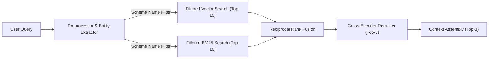
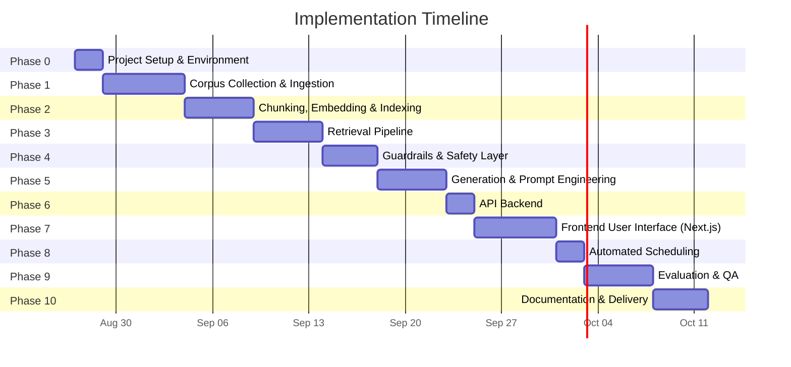

# Phase-Wise Implementation Plan — Mutual Fund Facts-Only FAQ Assistant

> **Project**: RAG-based FAQ Assistant for HDFC Mutual Fund Schemes  
> **Date**: 2026-08-26  
> **Source Documents**: [problemStatement.md](file:///d:/RAG%20Project/problemStatement.md) · [Architecture.md](file:///d:/RAG%20Project/Architecture.md)  
> **Estimated Total Duration**: 6–7 weeks

---

## Phase 0 — Project Setup & Environment (Days 1–2)

**Goal**: Establish the development environment, project scaffolding, and dependency management so all subsequent phases can build on a stable foundation.

### Tasks

| # | Task | Details |
|---|------|---------|
| 0.1 | **Repository Initialization** | Create project repo with `.gitignore` (include `.env`, `__pycache__`, `chroma_db/`, `*.pkl`), `README.md` skeleton, and directory structure (see below). |
| 0.2 | **Python Environment** | Set up Python 3.11+ virtual environment (`venv` or `conda`). Create `requirements.txt` with all dependencies. |
| 0.3 | **API Key Configuration** | Create `.env` template for `GEMINI_API_KEY` and/or `GROQ_API_KEY`. Document in README. |
| 0.4 | **Project Directory Structure** | Scaffold the directory layout (below). |
| 0.5 | **Dependency Installation** | Install and verify all core packages. |

#### Proposed Directory Structure

```
rag-mf-assistant/
├── data/
│   ├── raw/                   # Original PDFs and saved HTML pages
│   ├── processed/             # Cleaned text files with metadata
│   └── corpus_manifest.json   # Catalog of all source documents + metadata
├── ingestion/
│   ├── loader.py              # PDF and web page loaders
│   ├── preprocessor.py        # Cleaning, metadata extraction
│   ├── chunker.py             # Structure-aware chunking engine
│   └── indexer.py             # Embedding + ChromaDB + BM25 index builder
├── retrieval/
│   ├── query_preprocessor.py  # Query normalization, abbreviation expansion
│   ├── hybrid_retriever.py    # Dense + BM25 retrieval with RRF fusion
│   └── reranker.py            # Cross-encoder reranking
├── generation/
│   ├── prompts.py             # System prompt, few-shot examples
│   ├── generator.py           # LLM call and response formatting
│   └── response_formatter.py  # Enforce 3-sentence + citation + date format
├── guardrails/
│   ├── pii_scanner.py         # Regex-based PII detection
│   ├── query_classifier.py    # Factual vs. advisory vs. out-of-scope
│   └── groundedness_check.py  # Verify answer is grounded in retrieved chunks
├── evaluation/
│   ├── test_set.json          # 30–50 curated Q&A pairs
│   ├── evaluate.py            # RAGAS evaluation pipeline
│   └── results/               # Evaluation output reports
├── ui/
│   ├── app.py                 # Streamlit chat interface (legacy / quick demo)
│   └── stitch_hdfc_mutual_fund_facts_assistant/
│       ├── DESIGN.md          # Stitch design system tokens & brand guide
│       ├── code.html          # Stitch-generated reference HTML
│       └── screen.png         # Reference UI screenshot
├── frontend/                  # Next.js 14 (App Router) production frontend
│   ├── app/
│   │   ├── layout.tsx
│   │   ├── page.tsx           # Root → redirects to /chat
│   │   └── chat/
│   │       └── page.tsx       # Main chat interface page
│   ├── components/
│   │   ├── layout/
│   │   │   ├── Sidebar.tsx
│   │   │   └── TopBar.tsx
│   │   ├── chat/
│   │   │   ├── ChatWindow.tsx
│   │   │   ├── MessageBubble.tsx
│   │   │   ├── SuggestionChips.tsx
│   │   │   ├── InputBar.tsx
│   │   │   └── WelcomeScreen.tsx
│   │   └── ui/
│   │       ├── DisclaimerBanner.tsx
│   │       ├── LoadingDots.tsx
│   │       └── CitationLink.tsx
│   ├── lib/
│   │   ├── api.ts             # FastAPI client (POST /chat)
│   │   └── types.ts           # Shared TypeScript types
│   ├── styles/
│   │   └── globals.css        # Design tokens, base styles
│   ├── public/
│   │   └── favicon.svg
│   ├── next.config.ts
│   ├── tailwind.config.ts
│   ├── tsconfig.json
│   └── package.json
├── config.py                  # Central configuration (model names, thresholds, paths)
├── main.py                    # Orchestrator / entry point
├── requirements.txt
├── .env.template
├── .gitignore
└── README.md
```

#### Key Dependencies

```
langchain, langchain-community, langchain-google-genai
chromadb
sentence-transformers
rank_bm25
pdfplumber, PyMuPDF
beautifulsoup4, requests
streamlit
ragas
python-dotenv
```

### Exit Criteria
- [x] Repo initialized with complete directory structure
- [x] Virtual environment created, all dependencies install without errors
- [x] `.env` template created, API keys validated with a trivial test call
- [x] `config.py` established with all configurable constants

---

## Phase 1 — Corpus Collection & Data Ingestion Pipeline (Days 3–8)

**Goal**: Collect all source documents, build the document loading and preprocessing pipeline, and produce clean, metadata-tagged text ready for chunking.

### Tasks

| # | Task | Details |
|---|------|---------|
| 1.1 | **Corpus Definition** | Finalize 3–5 HDFC schemes and 15–25 source pages. Create `corpus_manifest.json` cataloging every document (URL, type, scheme, publisher, date). |
| 1.2 | **Web Page Loader** (`ingestion/loader.py`) | Implement `load_web_page()` using `BeautifulSoup` + `requests`. Parse HDFC MF FAQ pages, charges page, statement guides. Handle pagination if needed. |
| 1.3 | **Preprocessing** (`ingestion/preprocessor.py`) | Text cleaning: remove headers/footers/watermarks/boilerplate. Metadata extraction: `source_url`, `document_type`, `scheme_name`, `publisher`, `last_updated`. Preserve table structures. |
| 1.4 | **Quality Audit** | Manually inspect 3–5 processed documents. Verify table integrity, metadata correctness, and cleaning quality. |

### Source Documents Breakdown

| Source | Type | Documents / URLs |
|--------|------|-----------|
| Groww scheme pages (5 schemes) | Web HTML | - https://groww.in/mutual-funds/hdfc-mid-cap-fund-direct-growth<br>- https://groww.in/mutual-funds/hdfc-small-cap-fund-direct-growth<br>- https://groww.in/mutual-funds/hdfc-multi-cap-fund-direct-growth<br>- https://groww.in/mutual-funds/hdfc-large-and-mid-cap-fund-direct-growth<br>- https://groww.in/mutual-funds/hdfc-gold-etf-fund-of-fund-direct-plan-growth |


> [!IMPORTANT]
> Tables (expense ratios, exit loads, SIP amounts) are the **highest-value data**. The loader must preserve table structure intact — never split tables mid-row.

### Exit Criteria
- [x] `corpus_manifest.json` is complete with all source documents cataloged
- [x] Web loader parses all web pages into clean text
- [x] All processed documents have correct, complete metadata
- [x] Manual QA confirms table integrity is preserved

---

## Phase 2 — Chunking, Embedding & Indexing (Days 9–13)

**Goal**: Transform the pre-structured processed JSON documents into searchable chunks, generate embeddings, and build both the vector store (ChromaDB) and lexical index (BM25).

> [!IMPORTANT]
> The processed data is structured JSON (not raw text). Each file exposes **pre-segmented sections** (`summary_metrics`, `exit_load`, `returns_rankings`, `minimum_investments`) and a **`tables` array** of markdown table strings. The chunker must read these directly — do **not** re-parse the `text` field with a generic splitter.

### Tasks

| # | Task | Details |
|---|------|---------|
| 2.1 | **Section-Keyed Chunker** (`ingestion/chunker.py`) | Read each processed JSON file. Emit one chunk per pre-extracted section key (`summary_metrics`, `exit_load`, `returns_rankings`, `minimum_investments`). Each section becomes an independent chunk. |
| 2.2 | **Table Sub-Chunking** | Iterate the `tables` array. Small tables (≤ 30 rows, ≈ ≤ 500 tokens) → emit as a single atomic chunk. Large tables (e.g., portfolio holdings with 100+ rows) → batch into sub-chunks of **20–25 rows** each with a shared header row repeated; tag each sub-chunk with `table_index` and `batch_index`. Never split a row across sub-chunks. |
| 2.3 | **Exit Load Deduplication** | The `exit_load` section contains historical dated entries (e.g., "01 Jan 2013", "28 Jun 2014"). During chunking, extract and keep only the **current / most recent** exit load rule; discard superseded historical entries to avoid retrieval noise. |
| 2.4 | **Chunk Schema** | Every chunk carries: `chunk_id` (UUID), `text`, `chunk_type` (`section` \| `table` \| `table_batch`), `section_key`, `table_index`, `batch_index`, `metadata` (source_url, document_type, scheme_name, publisher, last_updated). |
| 2.5 | **Embedding Generation** (`ingestion/indexer.py`) | Use `BAAI/bge-large-en-v1.5` (1024-dim) to embed all chunks. |
| 2.6 | **ChromaDB Indexing** | Persist embedded chunks to ChromaDB (file-persisted, local). Store full `metadata` dict per chunk. |
| 2.7 | **BM25 Index** | Build and serialize (pickle) a BM25 index over the same chunk corpus for lexical search. |
| 2.8 | **Index Validation** | Run 10 sample queries (expense ratio, exit load, AUM, benchmark, minimum SIP) against both indexes. Verify correct scheme-specific chunks surface at top-3. |

#### Chunking Strategy — Data-Driven Design

Based on the actual processed JSON structure, each document yields the following chunk types:

```
Input:  processed JSON  →  { text, metadata, sections{}, tables[] }

Chunk Type 1 — Section Chunks (one per section key)
  • summary_metrics   → 1 chunk  (~50–80 tokens)
  • exit_load         → 1 chunk  (~100–150 tokens, deduplicated)
  • returns_rankings  → 1 chunk  (~80–120 tokens, includes table)
  • minimum_investments → 1 chunk (~40–60 tokens)

Chunk Type 2 — Table Chunks (from tables[] array)
  • SIP returns table (4 rows)         → 1 atomic chunk  (~80 tokens)
  • Returns & rankings table (3 rows)   → 1 atomic chunk  (~60 tokens)
  • Peer comparison table (5–6 rows)    → 1 atomic chunk  (~100 tokens)
  • Portfolio holdings table (100–200 rows)
      → batched into sub-chunks of 20–25 rows each
      → ~5–10 sub-chunks per equity fund; ~1 sub-chunk for Gold ETF
```

#### Chunking Configuration

```
Strategy:           Section-Keyed + Table Sub-Chunking
Input Format:       Processed JSON (sections dict + tables array)
Section Chunks:     One chunk per section key (no further splitting needed)
Small Table Threshold:   ≤ 30 rows → single atomic chunk
Large Table Batch Size:  20–25 rows per sub-chunk (header row repeated)
Overlap:            0 tokens for section chunks (sections are semantically complete)
                    0 rows between table batches (hard boundaries at row groups)
Exit Load:          Deduplicate — keep current rule only
No FAQ pairs:       Corpus has no FAQ Q&A format; omit FAQ chunking logic
Metadata:           Fully inherited from JSON `metadata` field per document
```

> [!NOTE]
> The original plan assumed 500–800 chunks based on a mixed PDF+web corpus. The **actual corpus** is 5 web-scraped JSON files only. Realistic chunk estimates are shown below — significantly smaller, which means faster embedding and lower ChromaDB overhead.

#### Revised Corpus Statistics

| Metric | Original Estimate | Revised (Actual Data) |
|--------|-------------------|-----------------------|
| Source Documents | ~13 (PDFs + web) | **5 web JSON files** |
| Section Chunks | — | ~20 (4 sections × 5 schemes) |
| Small Table Chunks | — | ~15 (3 small tables × 5 schemes) |
| Portfolio Table Sub-chunks | — | ~20–40 (equity funds: 5–10 each; Gold ETF: ~1) |
| **Total Chunks (estimated)** | **500–800** | **~55–75** |
| Vector Index Size | ~2–5 MB | **< 0.5 MB** |

> [!TIP]
> With only ~55–75 chunks, ChromaDB overhead is negligible. Consider setting `top-k` (vector + BM25 retrieval) to **10 instead of 20** during tuning, as the entire corpus is small.

### Exit Criteria
- [x] Chunker reads `sections` dict and `tables` array directly from each processed JSON
- [x] Each of the 4 section keys produces exactly 1 chunk per scheme (= 20 section chunks total)
- [x] Portfolio holdings tables are sub-chunked at 20–25 rows; header row is repeated in every sub-chunk
- [x] Exit load chunks contain only the current (most recent) rule — no historical dated entries
- [x] All chunks carry complete `chunk_type`, `section_key`, and full `metadata` fields
- [x] ChromaDB index is persisted and queryable
- [x] BM25 index is serialized and queryable
- [x] 10 sample queries return the correct scheme's chunk in top-3 results

---

## Phase 3 — Retrieval Pipeline (Days 14–18)

**Goal**: Build a metadata-aware hybrid retrieval system combining entity extraction, dense vector search, BM25 lexical search, Reciprocal Rank Fusion, and cross-encoder reranking.

### Tasks

| # | Task | Details |
|---|------|---------|
| 3.1 | **Query Preprocessor & Entity Extractor** (`retrieval/query_preprocessor.py`) | Normalize queries and expand abbreviations. Implement an LLM or regex-based extractor to identify the target `scheme_name` from the query (e.g., "HDFC Mid-Cap"). |
| 3.2 | **Metadata-Filtered Vector Search** | Query ChromaDB for Top-10 semantically similar chunks, applying a `where` filter on `scheme_name` (if detected) to prevent cross-scheme contamination. |
| 3.3 | **Metadata-Filtered BM25 Search** | Query BM25 index for Top-10 lexically matched chunks, restricting the search space to chunks matching the detected `scheme_name`. |
| 3.4 | **Reciprocal Rank Fusion** (`retrieval/hybrid_retriever.py`) | Merge filtered results using RRF: `score = Σ 1/(k + rank)` where `k = 60`. Deduplicate by `chunk_id`. |
| 3.5 | **Cross-Encoder Reranker** (`retrieval/reranker.py`) | Rerank merged candidates with `BAAI/bge-reranker-base`. Select Top-3 most relevant chunks. |
| 3.6 | **Context Assembly** | Concatenate Top-3 chunk texts with metadata (source URL, scheme name, last-updated date) into a structured context block for the LLM. |
| 3.7 | **Retrieval Pipeline Integration Test** | End-to-end test: query → entity extraction → filtered dual retrieval → RRF → reranker → context block. Validate on 10+ diverse queries. |

#### Retrieval Flow



> [!TIP]
> **Why Metadata Filtering?** With multiple schemes having identical sections (e.g., an "Expense Ratio" chunk), vector search alone might return the expense ratio of the wrong fund. Pre-filtering by `scheme_name` eliminates this cross-contamination entirely. BM25 is still used to ensure exact-match recall for domain-specific terms.

### Exit Criteria
- [ ] Query preprocessor handles abbreviation expansion correctly
- [ ] Dual retrieval returns results from both vector and BM25 indexes
- [ ] RRF correctly merges and deduplicates results
- [ ] Reranker produces meaningful re-ordering (Top-3 are highly relevant)
- [ ] Context assembly produces well-structured blocks with metadata

---

## Phase 4 — Guardrails & Safety Layer (Days 19–22)

**Goal**: Implement the pre-retrieval and post-generation safety layer: PII detection, advisory query classification, and groundedness checking.

### Tasks

| # | Task | Details |
|---|------|---------|
| 4.1 | **PII Scanner** (`guardrails/pii_scanner.py`) | Regex-based detection for PAN (`[A-Z]{5}[0-9]{4}[A-Z]`), Aadhaar (`\d{4}\s?\d{4}\s?\d{4}`), Phone (`(+91)?[6-9]\d{9}`), Email, Account Numbers (`\d{9,18}` contextual). Block and warn on detection. |
| 4.2 | **Query Classifier** (`guardrails/query_classifier.py`) | Keyword-based + few-shot LLM classification. Detect advisory intent ("should I", "recommend", "better", "vs", "compare returns", "expected return"). Classify as: `factual`, `advisory`, `out_of_scope`. |
| 4.3 | **Refusal Response Templates** | Implement polite refusal with AMFI/SEBI educational link. Implement out-of-scope response. |
| 4.4 | **Groundedness Check** (`guardrails/groundedness_check.py`) | Post-generation: verify that the LLM's answer is grounded in the retrieved chunks. If ungrounded, return fallback: "I don't have this information in my current sources." |
| 4.5 | **Unit Tests for Guardrails** | Test PII scanner with 10+ patterns (positive and negative). Test classifier with 15+ advisory and factual queries. Test groundedness check with grounded and hallucinated examples. |

#### PII Detection Patterns

| PII Type | Regex Pattern | Example |
|----------|--------------|---------|
| PAN | `[A-Z]{5}[0-9]{4}[A-Z]` | `ABCDE1234F` |
| Aadhaar | `\d{4}\s?\d{4}\s?\d{4}` | `1234 5678 9012` |
| Phone | `(\+91)?[6-9]\d{9}` | `+919876543210` |
| Email | Standard email regex | `user@example.com` |
| Account No. | `\d{9,18}` (contextual) | `123456789012` |

#### Advisory Detection Keywords

| Signal | Keywords/Patterns |
|--------|-------------------|
| Comparison | "better", "best", "vs", "compare returns" |
| Advice-seeking | "should I", "recommend", "suggest", "is it good" |
| Return prediction | "will it give", "expected return", "future performance" |

#### Refusal Template
```
I'm designed to provide only factual information about mutual fund schemes.
For investment guidance, please consult a SEBI-registered advisor or visit
https://www.amfiindia.com/investor-corner/knowledge-center.html
```

### Exit Criteria
- [ ] PII scanner catches all defined patterns with zero false negatives on test set
- [ ] Query classifier correctly categorizes 95%+ of test queries
- [ ] Refusal responses are polite and include the correct educational link
- [ ] Groundedness check catches at least 1 known hallucinated example
- [ ] All guardrail unit tests pass

---

## Phase 5 — Generation Layer & Prompt Engineering (Days 23–27)

**Goal**: Wire up the LLM generation with the system prompt, few-shot examples, and response formatting to produce concise, cited, facts-only answers.

### Tasks

| # | Task | Details |
|---|------|---------|
| 5.1 | **System Prompt** (`generation/prompts.py`) | Implement the hardcoded system prompt with all 6 rules (context-only answers, 3-sentence limit, no advice, citation format, refusal handling, fallback). Include few-shot examples. |
| 5.2 | **LLM Integration** (`generation/generator.py`) | Primary: `google/gemini-3.1-pro` via API. Fallback: Groq-hosted model via Groq API. Temperature: `0.0`, Max tokens: `200`. |
| 5.3 | **Response Formatter** (`generation/response_formatter.py`) | Enforce output format: answer (≤3 sentences) + `Source: <URL>` + `Last updated from sources: <YYYY-MM-DD>`. Parse and validate before delivery. |
| 5.4 | **Fallback Logic** | If no chunks retrieved above similarity threshold → return: "I don't have this information in my current sources. Please check the official HDFC MF website." |
| 5.5 | **End-to-End Orchestrator** (`main.py`) | Wire the complete pipeline: Query → PII Scan → Classify → Preprocess → Retrieve → Rerank → Context Assembly → LLM Generate → Groundedness Check → Format → Respond. |
| 5.6 | **Integration Testing** | Run 15+ diverse queries through the full pipeline. Verify format compliance, citation accuracy, refusal behavior, and PII blocking. |

#### LLM Configuration

| Parameter | Value | Rationale |
|-----------|-------|-----------|
| Model (Primary) | `google/gemini-3.1-pro` | High accuracy, superior reasoning, strong instruction-following |
| Model (Fallback) | Groq (e.g., `llama-3.3-70b-versatile`) | Ultra-fast inference, alternative provider for resilience |
| Temperature | `0.0` | Deterministic — no creativity needed for facts |
| Max Output Tokens | `200` | Enforces brevity (≤3 sentences) |

#### Response Format (Enforced)

```
<Answer in 3 sentences or fewer>

Source: <URL>
Last updated from sources: <YYYY-MM-DD>
```

### Exit Criteria
- [ ] System prompt produces correctly formatted, factual responses
- [ ] LLM fallback triggers correctly when primary API is unavailable
- [ ] Response formatter catches and corrects malformed outputs
- [ ] Fallback response is returned when no relevant chunks are found
- [ ] End-to-end pipeline handles factual, advisory, PII, and out-of-scope queries correctly
- [ ] All 15+ integration test queries produce expected behavior

---

## Phase 6 — API Backend (Days 28–29)

**Goal**: Wrap the orchestrator in a FastAPI application to serve queries via a RESTful endpoint.

### Tasks

| # | Task | Details |
|---|------|---------|
| 6.1 | **FastAPI Setup** (`api/main.py`) | Initialize FastAPI app, define request/response Pydantic models. |
| 6.2 | **Query Endpoint** | Create `POST /chat` endpoint that calls `MutualFundAssistant.process_query()`. |
| 6.3 | **CORS Configuration** | Configure CORS middleware to allow requests from the frontend. |
| 6.4 | **Error Handling** | Implement global exception handlers and return appropriate HTTP status codes. |

### Exit Criteria
- [ ] FastAPI app launches with `uvicorn api.main:app` without errors
- [ ] `POST /chat` successfully returns formatted answers
- [ ] Proper HTTP status codes are returned on errors

---

## Phase 7 — Frontend User Interface (Days 30–35)

**Goal**: Build a production-quality **Next.js 14 (App Router)** chat interface that faithfully implements the Stitch design system (`ui/stitch_hdfc_mutual_fund_facts_assistant/DESIGN.md`) — pixel-perfect Groww-style UI, full TypeScript, responsive layout, and smooth micro-animations — connected to the FastAPI backend.

> [!IMPORTANT]
> The frontend source lives at `frontend/` (Next.js app) within the project root.
> The Stitch design system (`DESIGN.md` + `screen.png`) in `ui/stitch_hdfc_mutual_fund_facts_assistant/` is the **authoritative design reference** and must be followed precisely for colors, typography, spacing, shapes, and component behavior.
> The legacy `ui/app.py` (Streamlit) is retained for quick local demos only and is **not** the deliverable for this phase.

---

### Design System Reference (from Stitch DESIGN.md)

| Token | Value | Usage |
|-------|-------|-------|
| **Primary / Groww Green** | `#00D09C` | CTAs, active states, focus rings, positive metrics |
| **Primary Dark** | `#006C4F` | Sidebar brand text, hover deepening |
| **Background** | `#F8F9FA` | App background |
| **Surface White** | `#FFFFFF` | Cards, chat bubbles, input field |
| **Text Primary** | `#191C1D` | Headlines, user messages |
| **Text Secondary** | `#3C4A43` | Body copy, metadata, timestamps |
| **Border / Outline** | `#EDF2F7` / `#BACAC1` | Card borders, separators |
| **Error** | `#BA1A1A` | PII warnings, error states |
| **Font** | Inter (400 / 500 / 600 / 700) | All typography |
| **Radius – Cards** | `16px` | Chat bubbles, data cards |
| **Radius – Buttons/Chips** | `9999px` (pill) | Send button, suggestion chips |
| **Radius – Inputs** | `8px` | Text input field |
| **Spacing base** | `8px` | All spacing increments |
| **Shadow (hover)** | `0 4px 12px rgba(0,0,0,0.05)` | Card hover lift |

---

### Tech Stack

| Layer | Choice | Rationale |
|-------|--------|-----------|
| Framework | **Next.js 14 (App Router)** | SSR-ready, file-based routing, React Server Components |
| Language | **TypeScript** | Type safety across API contract + components |
| Styling | **Tailwind CSS v3** (with Stitch tokens) | Mirrors existing Stitch config; utility-first |
| Animations | **Framer Motion** | Smooth message entry, typing dots, page transitions |
| State | **React Context + useReducer** | Chat session state (no external lib needed) |
| HTTP Client | **fetch** (native) + SWR | `POST /chat` calls + re-validation |
| Fonts | **Google Fonts – Inter** | Matches Stitch typography spec |
| Icons | **Lucide React** | Lightweight, consistent with Stitch icon style |
| Dev Server | `npm run dev` (port 3000) | Proxied to FastAPI on port 8000 |

---

### Tasks

| # | Task | File(s) | Details |
|---|------|---------|---------|
| 7.1 | **Bootstrap Next.js App** | `frontend/` | `npx create-next-app@latest frontend --typescript --tailwind --app --no-src-dir`. Add Framer Motion, Lucide React. Configure Tailwind with full Stitch color/radius/spacing tokens. |
| 7.2 | **Global Design Tokens** | `tailwind.config.ts`, `styles/globals.css` | Port ALL Stitch color tokens, typography scale (Inter), spacing base-8 system, and borderRadius values into Tailwind config. Add CSS variables for runtime theming. Set `font-family: Inter` globally. |
| 7.3 | **App Layout & Sidebar** | `app/layout.tsx`, `components/layout/Sidebar.tsx` | Fixed left sidebar (240px). Brand header: "**Mutual Fund Assistant**" in primary green + "Expert Assistant" subtitle. Nav items with icons: Chat History (active), Market Insights, Portfolio Analysis, Help & Support. Bottom items: Settings, Log Out. Highlight active item with `surface-container` background. Collapse to icon-only on mobile. |
| 7.4 | **TopBar** | `components/layout/TopBar.tsx` | Sticky top bar: disclaimer banner `ⓘ Facts-only. No investment advice.` with amber/info styling. Right: user avatar icon + notification bell (static). 1px bottom border `#EDF2F7`. |
| 7.5 | **Welcome Screen** | `components/chat/WelcomeScreen.tsx` | Centered: animated chart icon, `"How can I assist you today?"` (Inter 600, 32px), subtitle, and 3 clickable suggestion chips (pill-shaped, `#F1F3F6` bg → Groww Green on hover/click). Chips pre-fill the input on click. Fade-in with Framer Motion on mount. |
| 7.6 | **Chat Window** | `components/chat/ChatWindow.tsx` | Scrollable message list. Auto-scroll to latest message. Smooth `AnimatePresence` for new message entry (slide-up + fade). Empty state shows `WelcomeScreen`. |
| 7.7 | **Message Bubbles** | `components/chat/MessageBubble.tsx` | **User**: right-aligned, Groww Green background (`#00D09C`), white text, pill radius. **Assistant**: left-aligned, white card with 1px `#EDF2F7` border, 16px radius. Assistant bubble shows: answer text + `CitationLink` + `"Last updated: YYYY-MM-DD"` footer in label-md. Timestamp on hover. |
| 7.8 | **Loading Dots** | `components/ui/LoadingDots.tsx` | Three animated bouncing dots in Groww Green while awaiting API response. Framer Motion stagger animation. Renders inside an assistant bubble placeholder. |
| 7.9 | **Citation Link** | `components/ui/CitationLink.tsx` | Inline `<a>` rendered as `Source: [hostname]` with external link icon. Opens in new tab. Styled in `#006C4F` (primary-dark), underline on hover. |
| 7.10 | **Disclaimer Banner** | `components/ui/DisclaimerBanner.tsx` | Reusable info strip for advisory-refusal responses. Amber-tinted background, info icon, refusal text + AMFI link. |
| 7.11 | **Suggestion Chips** | `components/chat/SuggestionChips.tsx` | Horizontally scrollable row of pill chips below the welcome message. Click → populate input. After first query, chips disappear. |
| 7.12 | **Input Bar** | `components/chat/InputBar.tsx` | Full-width sticky input at bottom: white bg, 8px radius, 1px border → Groww Green focus ring. Send button: circle, Groww Green fill, white arrow icon. Enter-to-submit. Disabled + spinner when loading. Character count warning at 500 chars. |
| 7.13 | **FastAPI Client** | `lib/api.ts` | `async function sendMessage(query: string): Promise<ChatResponse>` using native fetch `POST http://localhost:8000/chat`. Returns typed `ChatResponse` with `answer`, `source_url`, `last_updated`, `query_type`. Next.js `next.config.ts` proxy rewrites `/api/*` → `http://localhost:8000/*` to avoid CORS issues in dev. |
| 7.14 | **TypeScript Types** | `lib/types.ts` | `Message`, `ChatResponse`, `QueryType` (`factual` \| `advisory` \| `pii` \| `out_of_scope`), `ChatSession` interfaces. |
| 7.15 | **Chat State Management** | `app/chat/page.tsx` + Context | `useReducer` for message list. Actions: `ADD_USER_MSG`, `ADD_BOT_MSG`, `SET_LOADING`, `SET_ERROR`. Session stored in `sessionStorage` for tab-level persistence. |
| 7.16 | **Error & Edge-case States** | Inline in components | API timeout → toast notification (bottom-right, 3s). Advisory query → `DisclaimerBanner` inside the bot bubble. PII detected → error-styled bot bubble with lock icon. Out-of-scope → neutral bot bubble with info icon. |
| 7.17 | **Responsive Layout** | All components | Mobile (<600px): sidebar collapses to bottom tab bar (Chat, History, Help). Tablet: sidebar icon-only. Desktop: full sidebar. Chat bubbles max-width: 80% desktop, 100% mobile. |
| 7.18 | **Accessibility** | All components | `aria-label` on all icon buttons. Focus-visible rings in Groww Green. `role="log"` on chat window. `aria-live="polite"` for new messages. Keyboard-navigable suggestion chips. |
| 7.19 | **Performance** | `next.config.ts` | Google Fonts via `next/font`. Image optimization via `next/image`. No unused Tailwind classes (PurgeCSS in production build). |
| 7.20 | **New Analysis Flow** | `components/layout/Sidebar.tsx` | "+ New Analysis" primary button at sidebar top. Click → clears chat session, resets to WelcomeScreen with Framer Motion fade transition. |

---

### Component Architecture

```
app/
└── chat/page.tsx          ← Orchestrates state; renders layout
    ├── Sidebar            ← Fixed left nav
    ├── TopBar             ← Disclaimer + icons
    └── main
        ├── ChatWindow     ← Scrollable messages
        │   ├── WelcomeScreen (when empty)
        │   ├── MessageBubble × N
        │   │   ├── CitationLink
        │   │   └── DisclaimerBanner (advisory responses)
        │   └── LoadingDots (while fetching)
        └── InputBar       ← Sticky bottom input + send
            └── SuggestionChips (pre-first-message only)
```

---

### API Contract (Frontend ↔ FastAPI)

```ts
// POST /chat  →  Request
interface ChatRequest {
  query: string;
}

// POST /chat  ←  Response
interface ChatResponse {
  answer: string;          // ≤ 3 sentences
  source_url: string;      // Citation URL
  last_updated: string;    // ISO date YYYY-MM-DD
  query_type: "factual" | "advisory" | "pii" | "out_of_scope";
}
```

---

### UI Reference — Annotated Layout

```
┌──────────────────────────────────────────────────────────────────┐
│ SIDEBAR (240px)          │ TOP BAR (sticky)                      │
│ ─────────────────────── │ ⓘ Facts-only. No investment advice.   │
│ Mutual Fund Assistant    │                                        │
│ Expert Assistant         │──────────────────────────────────────  │
│                          │                                        │
│ [+] New Analysis   ←CTA │   CHAT WINDOW (scrollable flex-col)   │
│                          │                                        │
│ 🕐 Chat History  ←active │   ┌─── WelcomeScreen (empty state) ─┐ │
│ 📈 Market Insights       │   │  📊  How can I assist you today? │ │
│ 📊 Portfolio Analysis    │   │  [chip1] [chip2] [chip3]         │ │
│ ❓ Help & Support        │   └──────────────────────────────────┘ │
│                          │                                        │
│                          │   👤 User bubble (Groww Green, right) │
│                          │   🤖 Bot bubble (white card, left)    │
│                          │      Answer text                       │
│                          │      Source: groww.in/...             │
│ ─────────────────────── │      Last updated: 2025-01-01         │
│ ⚙ Settings              │                                        │
│ → Log Out                │ INPUT BAR (sticky bottom)             │
│                          │ ┌────────────────────────────┐ [▶]   │
└──────────────────────────│ │ Type your question...       │       │
                           │ └────────────────────────────┘       │
                           └────────────────────────────────────────┘
```

---

### Micro-Animation Specs (Framer Motion)

| Element | Animation | Config |
|---------|-----------|--------|
| Welcome screen | Fade in + slide up | `initial: {opacity:0, y:20}` → 300ms ease-out |
| New message bubble | Slide in from bottom + fade | `initial: {opacity:0, y:10}` → 250ms |
| Loading dots | Staggered bounce | 3 dots, 0.15s stagger, infinite loop |
| Suggestion chips | Staggered fade in | 5 chips, 0.08s stagger on mount |
| New Analysis | Fade out chat → fade in welcome | 200ms cross-fade |
| Send button | Scale on press | `whileTap: {scale:0.9}` |
| Error toast | Slide in from right | `initial: {x:100}` → 300ms spring |

---

### Exit Criteria
- [x] `npm run dev` starts Next.js on port 3000 without errors
- [x] All Stitch design tokens (colors, typography, spacing, radii) applied correctly — visually matches `screen.png`
- [x] Sidebar renders with all nav items; "+ New Analysis" clears the chat
- [x] Disclaimer banner visible in TopBar on load
- [x] Welcome screen with 3 suggestion chips shown on empty state
- [x] Chips pre-fill the input on click
- [x] User message appears right-aligned in Groww Green bubble immediately on send
- [x] Loading dots appear in an assistant bubble while API call is in flight
- [x] Factual responses render with answer text, clickable citation link, and date
- [x] Advisory responses render `DisclaimerBanner` with AMFI link inside bot bubble
- [x] PII responses render error-styled bubble with lock icon
- [x] Chat auto-scrolls to latest message
- [x] Input disabled during loading; enabled after response
- [x] Responsive: layout works on 375px (mobile), 768px (tablet), 1440px (desktop)
- [x] All interactive elements are keyboard-navigable and have `aria-label`
- [x] `next build` completes with zero TypeScript errors

---

## Phase 8 — Automated Scheduling & Data Refresh (Days 36–37)

**Goal**: Implement a GitHub Actions workflow to run the ingestion pipeline daily, ensuring the vector database and lexical index always reflect the latest mutual fund data.

### Tasks

| # | Task | Details |
|---|------|---------|
| 8.1 | **GitHub Actions Workflow** (`.github/workflows/daily_ingestion.yml`) | Create a workflow triggered by a `schedule` (cron) to run daily. |
| 8.2 | **Environment Setup in CI** | Configure the action to checkout the repository, set up Python, and install dependencies. |
| 8.3 | **Run Ingestion Pipeline** | Add a step to execute the ingestion script (scraping, normalization, chunking, embedding, ChromaDB update). |
| 8.4 | **Persist Updated Indexes** | Ensure the updated ChromaDB files and BM25 index are committed back to the repository or synced to cloud storage. |
| 8.5 | **Failure Notifications** | Configure the workflow to notify maintainers if the daily run fails. |

### Exit Criteria
- [ ] GitHub Actions workflow file is created and syntactically valid
- [ ] The workflow successfully runs the entire ingestion pipeline (scraping to indexing)
- [ ] The updated ChromaDB and BM25 index are properly persisted after the run
- [ ] The workflow is scheduled to run daily

---

## Phase 9 — Evaluation & Quality Assurance (Days 38–42)

**Goal**: Build the curated test set, run the RAGAS evaluation pipeline, measure all target metrics, and iterate until quality thresholds are met.

### Tasks

| # | Task | Details |
|---|------|---------|
| 9.1 | **Curated Test Set** (`evaluation/test_set.json`) | Build 30–50 Q&A pairs across all categories (see table below). |
| 9.2 | **RAGAS Evaluation Pipeline** (`evaluation/evaluate.py`) | Integrate RAGAS framework. Input: `(question, ground_truth, retrieved_contexts, generated_answer)`. Output: faithfulness, answer_relevance, context_recall, context_precision. |
| 9.3 | **Custom Metric: Refusal Accuracy** | Evaluate 100% correct refusal of advisory queries. |
| 9.4 | **Custom Metric: Citation Accuracy** | Evaluate 100% valid source links in responses. |
| 9.5 | **Run Full Evaluation** | Execute evaluation pipeline on complete test set. Generate results report. |
| 9.6 | **Gap Analysis & Iteration** | Identify failing categories. Iterate on chunking, retrieval parameters, or prompts until targets are met. |
| 9.7 | **Evaluation Report** | Document final metrics, edge cases, and known failure modes in `evaluation/results/`. |

#### Test Set Categories

| Category | Count | Example Query |
|----------|-------|---------------|
| Factual – Expense Ratio | 5–8 | "What is the expense ratio of HDFC Small Cap Fund?" |
| Factual – Exit Load | 5–8 | "Is there an exit load for HDFC ELSS Tax Saver?" |
| Factual – SIP / Min Investment | 3–5 | "What is the minimum SIP amount for HDFC Large Cap?" |
| Factual – Process / How-To | 3–5 | "How do I download my capital gains statement?" |
| Factual – Riskometer / Benchmark | 3–5 | "What is the benchmark for HDFC Mid-Cap Fund?" |
| Advisory (must refuse) | 5–8 | "Should I switch from HDFC ELSS to Mid-Cap?" |
| PII (must block) | 3–5 | "My PAN is ABCDE1234F, check my portfolio" |
| Out of Scope | 3–5 | "What is the weather today?" |

#### Target Metrics

| Metric | Target |
|--------|--------|
| Context Recall | ≥ 90% |
| Retrieval Precision | ≥ 80% |
| Faithfulness | ≥ 95% |
| Answer Relevance | ≥ 85% |
| Refusal Accuracy | 100% |
| Citation Accuracy | 100% |

### Exit Criteria
- [ ] Test set of 30–50 Q&A pairs is complete and reviewed
- [ ] RAGAS pipeline runs end-to-end and produces metric scores
- [ ] All target metrics are met or exceeded
- [ ] Edge cases and failure modes are documented
- [ ] Evaluation report is generated in `evaluation/results/`

---

## Phase 10 — Documentation & Delivery (Days 43–46)

**Goal**: Complete all documentation, finalize the README, and prepare the project for handoff/demo.

### Tasks

| # | Task | Details |
|---|------|---------|
| 10.1 | **README.md** | Setup instructions (environment, dependencies, API keys), selected AMC/schemes, architecture overview (RAG diagram), how to run ingestion vs. app, known limitations. |
| 10.2 | **Architecture Documentation** | Finalize [Architecture.md](file:///d:/RAG%20Project/Architecture.md) with any changes discovered during implementation. |
| 10.3 | **Inline Code Documentation** | Docstrings for all modules, functions, and classes. |
| 10.4 | **Configuration Guide** | Document all tunable parameters in `config.py` (chunk size, overlap, top-k, similarity threshold, model selection). |
| 10.5 | **Known Limitations** | Document: static corpus, single AMC, PDF parsing quality, no multi-turn context, LLM API dependency. |
| 10.6 | **Demo Preparation** | Prepare 5 demo queries (2 factual, 1 advisory refusal, 1 PII block, 1 out-of-scope). Run through the app to generate a demo walkthrough. |

### Deliverables Checklist

| Deliverable | Status |
|-------------|--------|
| Working prototype FAQ assistant | ☐ |
| README with setup instructions | ☐ |
| Selected AMC/schemes documented | ☐ |
| Architecture overview (RAG) | ☐ |
| Known limitations documented | ☐ |
| Disclaimer snippet in UI | ☐ |
| Evaluation report with metrics | ☐ |
| Automated Scheduler workflow | ☐ |

### Exit Criteria
- [ ] README enables a new developer to set up and run the project from scratch
- [ ] All code has adequate docstrings and comments
- [ ] Demo walkthrough covers all key scenarios
- [ ] All deliverables from the problem statement are addressed

---

## Timeline Summary



| Phase | Description | Duration | Dependencies |
|-------|-------------|----------|--------------|
| **0** | Project Setup & Environment | 2 days | — |
| **1** | Corpus Collection & Data Ingestion | 6 days | Phase 0 |
| **2** | Chunking, Embedding & Indexing | 5 days | Phase 1 |
| **3** | Retrieval Pipeline | 5 days | Phase 2 |
| **4** | Guardrails & Safety Layer | 4 days | Phase 0 (can start in parallel with Phase 3) |
| **5** | Generation & Prompt Engineering | 5 days | Phases 3 + 4 |
| **6** | API Backend | 2 days | Phase 5 |
| **7** | Frontend User Interface (Next.js 14) | **6 days** | Phase 6 |
| **8** | Automated Scheduling & Data Refresh | 2 days | Phase 7 |
| **9** | Evaluation & Quality Assurance | 5 days | Phase 8 |
| **10** | Documentation & Delivery | 4 days | Phase 9 |

> [!TIP]
> **Parallelism opportunity**: Phase 4 (Guardrails) is largely independent and can be developed in parallel with Phases 2–3 to compress the timeline by ~4 days.

---

## Risk Mitigation

| Risk | Impact | Mitigation |
|------|--------|------------|
| PDF tables don't parse cleanly | High-value data (expense ratios, exit loads) lost | Use `pdfplumber` specifically for tables; manual QA on chunked output; consider manual data entry as backup |
| Embedding model doesn't capture financial terms well | Poor retrieval for domain-specific queries | BM25 hybrid retrieval compensates; expand abbreviation dictionary; consider domain-tuned embeddings if needed |
| Gemini API rate limits during development | Blocked development and testing | Use Groq as fallback; cache LLM responses during testing; batch evaluation runs |
| Web pages change structure | Scraper breaks | Pin scraped data in `data/raw/`; re-scrape only when explicitly refreshing corpus |
| Evaluation metrics below target | Delayed delivery | Budget iteration time in Phase 7; prioritize faithfulness and refusal accuracy first |

---

> **Summary**: This plan decomposes the project into 10 sequential phases (0–9), each with clear tasks, exit criteria, and dependencies. The architecture's offline/online separation maps naturally to the phasing — ingestion/indexing complete before retrieval/generation work begins. The plan prioritizes **data quality** (Phase 1–2) and **safety** (Phase 4) as foundational, with iteration loops built into the evaluation phase (Phase 7).
